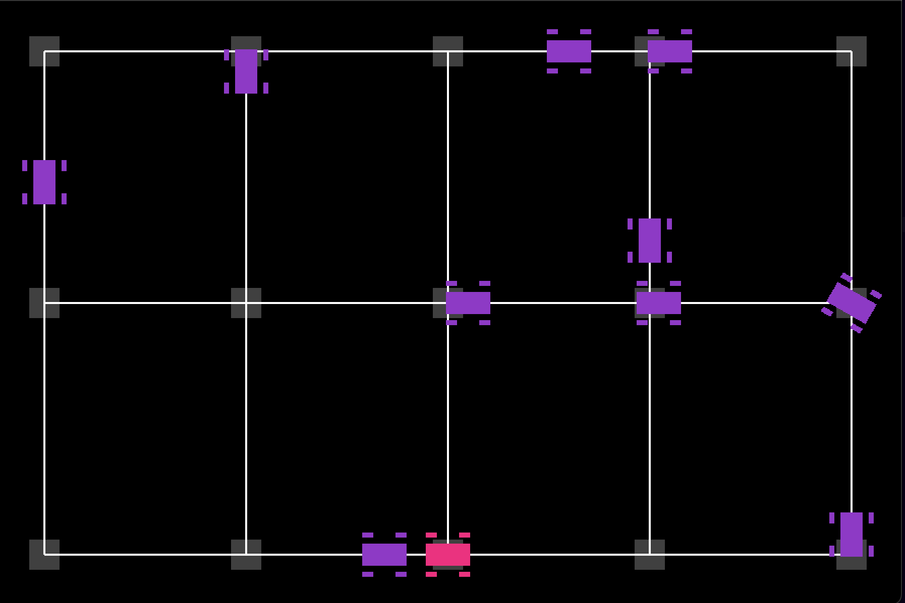

# Traffic Simulator with OpenGL



A 2D city traffic simulation featuring:
- Human-controlled car (HC)
- 10 autonomous cars (MC)
- Graph-based navigation
- Collision detection

## Files
- `Main.py`: Main simulation loop
- `Carro.py`: Car logic and rendering
- `StreetMap.py`: City graph implementation

## How to Run
```bash
python Main.py
```
*(Requires Pygame and OpenGL)*